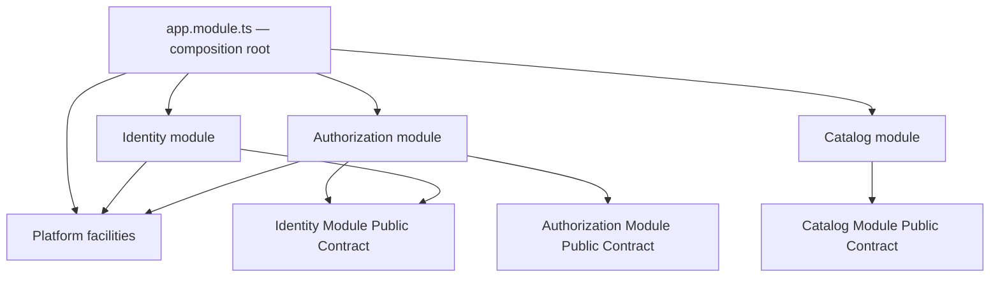
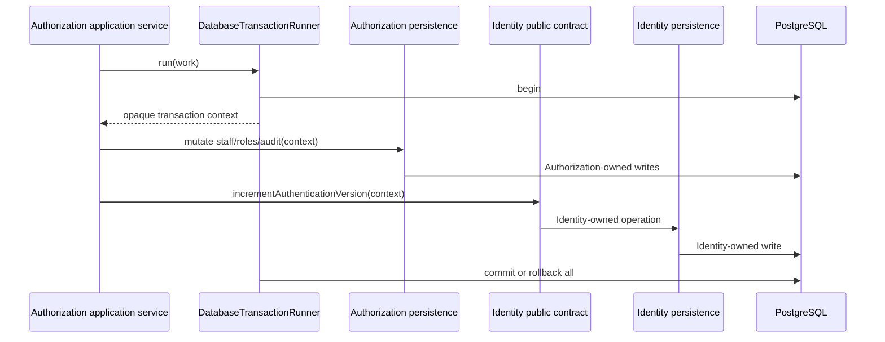

# Backend Module Map

Status: Living document  
Last verified: 2026-07-23

## Purpose

This document describes the currently implemented API structure and dependency
boundaries. ADR-0003 explains why these boundaries exist; this document changes
when the implementation changes.

## Current source map

```text
apps/api/src/
  app.module.ts                 Composition root

  modules/
    identity/
      auth/                     Registration, login, guards, password policy
      persistence/              User, credentials, verification persistence
      session/                  Session policy and Redis-backed session behavior
      identity.module.ts
      identity-administration.contract.ts
      index.ts                  Module Public Contract

    authorization/
      audit/                    Authorization audit queries
      bootstrap/                Initial owner bootstrap
      data/                     Authorization persistence and catalogue
      enforcement/              Guards, permission metadata, context
      staff/                    Staff lifecycle operations
      authorization.module.ts
      index.ts                  Module Public Contract

    catalog/
      application/              Product commands, projections, and contract
      domain/                   Catalog lifecycle and normalization rules
      http/                     Administrative and public Catalog transport
      persistence/              Catalog-owned TypeORM mappings and operations
      catalog.module.ts
      index.ts                  Narrow Variant-facts Module Public Contract

  platform/
    config/                     Environment parsing and validation
    database/                   TypeORM configuration and opaque transactions
    health/                     Liveness and readiness
    http/authentication/        Public-route transport metadata
    observability/              Logging, request IDs, problem details
    openapi/                    OpenAPI generation and transport decorators
    redis/                      Redis connectivity
    security/                   CSRF, trusted origins, abuse protection

  architecture/
    module-boundaries.spec.ts   Automated ADR-0003 dependency checks
```

Catalog is implemented for Products and Variants only. Pricing, Inventory, and
Orders remain accepted future capabilities in ADR-0004 and are not implemented.

## Dependency direction



The composition root may know all concrete modules. Platform facilities do not
import business modules. Authorization consumes Identity only through
Identity's public contract, except for the private persistence-only foreign-key
metadata described below.

## Cross-module authorization transaction

Privilege changes require Authorization state, its audit record, and Identity's
authentication version to commit or roll back together.



Application code receives no TypeORM `EntityManager`, repository, or entity.
The manager is held in a private infrastructure `WeakMap` and may be unwrapped
only by platform database code and module persistence implementations.

## Foreign-key metadata exception

Authorization stores scalar Identity user IDs. TypeORM development/test schema
synchronization still requires Identity entity metadata to create deliberate
PostgreSQL foreign keys.

The only permitted deep Identity persistence import is:

```text
modules/authorization/data/identity-user-foreign-key.persistence.ts
```

It is not publicly exported or used for business reads/writes. Associated ORM
relations are private, non-eager, non-lazy, and non-cascading. Automated
architecture tests enforce this exception and reject additional deep imports.

## Runtime data boundaries

- PostgreSQL is authoritative for Identity, Authorization, and future commerce
  state.
- Redis is authoritative for opaque sessions and distributed abuse-protection
  counters.
- Every merchant deployment has its own PostgreSQL, Redis, secrets, and
  operational lifecycle.
- There is no tenant resolver or shared cross-store runtime data.

## When to update this document

Update this map when:

- a real business module or platform facility is introduced or removed;
- a Module Public Contract changes shape;
- transaction ownership or dependency direction changes through an accepted
  decision;
- a persistence-only boundary exception is added or removed;
- the deployment topology changes.

Do not update this living document to describe planned code as if it already
exists.
